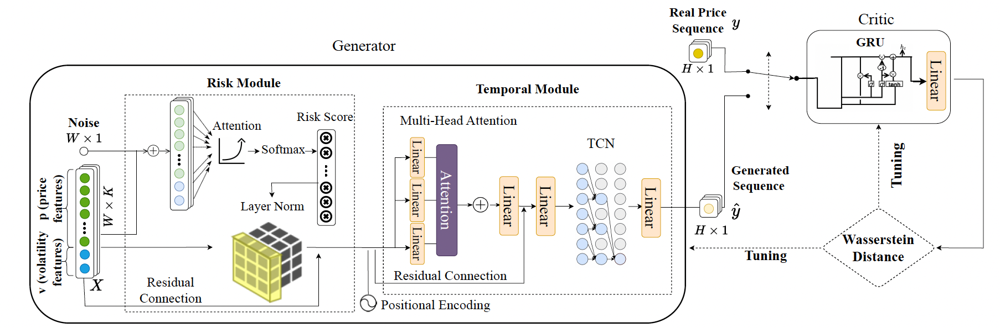
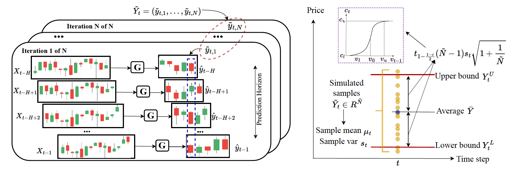

# RAGIC: Risk-Aware Generative Model for Interval Construction  

[](https://ieeexplore.ieee.org/abstract/document/10885039)  
[](https://arxiv.org/abs/2402.10760)  

🚀 **RAGIC has been accepted by IEEE Transactions on Knowledge and Data Engineering (TKDE) 2025!** 🎉  

## 🔹 Overview  

RAGIC (**R**isk-**A**ware **G**enerative model for **I**nterval **C**onstruction) is a novel deep learning framework designed for **stock market interval prediction**, addressing the **stochastic nature of financial markets**. Unlike traditional point prediction, RAGIC forecasts a **price range** (lower and upper bounds), providing **uncertainty-aware and risk-sensitive predictions**.  

### 🌟 **Key Features**  
- **Risk-Aware Forecasting**: Integrates the **volatility index** to **dynamically adjust interval width** based on market risk.  
- **Generative Model for Market Scenarios**: Uses **GANs** to simulate **diverse market conditions**, including extreme events.  
- **Two-Phase Framework**:  
  1. **Sequence Generation**: GAN-based model learns historical stock patterns and simulates future price sequences.  
  2. **Interval Construction**: A **horizon-wise strategy** gathers predictions across different time horizons, adjusting **risk-sensitive intervals** adaptively.  
- **Lightweight & Scalable**: Trained **once**, reusable for multiple sequence generations, relying on **public data only**.  
- **State-of-the-Art Performance**: Achieves **95%+ coverage** with **narrow, informative intervals**, outperforming baselines on global stock indices.  

---

## 📖 **Methodology**  

### **1️⃣ Sequence Generation (GAN-based Forecasting)**  
RAGIC employs a **GAN model** to generate diverse **future price sequences** by learning historical market features. The **generator** consists of:  
- **Risk Module**: Captures market risk via a **risk attention score** derived from the **volatility index** (e.g., VIX for SPX, VXD for DOW).  
- **Temporal Module**: Extracts **multi-scale trends** from historical prices, capturing both **local** and **global** patterns.  
- **Latent Space Randomness**: Introduces stochasticity throughout the model layers, ensuring realistic financial variability.  

<p align="center">
  
</p>

---

### **2️⃣ Interval Construction (Risk-Sensitive Prediction Intervals)**  
- Implements a **horizon-wise strategy** to aggregate multiple simulated sequences.  
- Uses **statistical inference** to construct **adaptive intervals** with width based on market risk.  
- A **wider interval** signals higher market volatility, aiding in **risk assessment and hedging strategies**.  

<p align="center">
  
</p>

---

## 🚀 **Contributions**  
✅ **First generative model for interval prediction in finance**  
✅ **Risk-sensitive interval adjustment** using volatility index insights  
✅ **Superior performance**: Consistently achieves **95%+ coverage** with balanced informativeness  
✅ **Scalable & practical**: Trained once, adaptable across **global stock indices**  

---

The code will be released soon.


## Citation
If you use this work for your research, please kindly cite our paper:
```
@article{gu2025ragic,
  title={RAGIC: Risk-Aware Generative Framework for Stock Interval Construction},
  author={Gu, Jingyi and Du, Wenlu and Wang, Guiling},
  journal={IEEE Transactions on Knowledge and Data Engineering},
  year={2025},
  publisher={IEEE},
  doi={10.1109/TKDE.2025.3533492}
}
```
